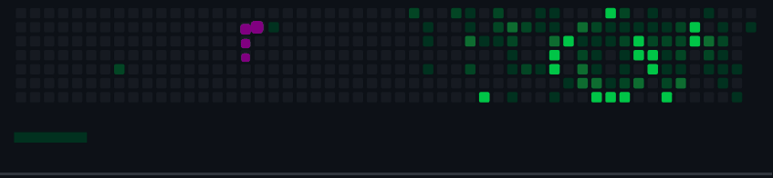

# :smiley:  *Olá, Mundo!* Eu sou Erika! 

__*Sou altamente motivada, disciplinada e profissional com grande paixão por tecnologia, conforme os avanços tecnológicos sigo avançando junto.Trabalho bem tanto individualmente como em equipe. Acredito que minhas habilidades ajudariam na expansão do mundo na tecnologia e quero fazer parte desse crescimento.*__

<b>
"Tudo tem o seu tempo determinado, e há tempo para todo o propósito debaixo do céu." Eclesiastes 3:1

<b>
"O que vale na vida não é o ponto de partida e sim a caminhada. Caminhando e semeando, no fim, terás o que colher."

Cora Coralina

<b>
"Feliz aquele que transfere o que sabe e aprende o que ensina."

Cora Coralina
***

 

## 👩  *Um pouco sobre mim:*
***
- 📫 __*Como chegar até mim:*__ https://www.linkedin.com/in/erikafrocha/
- ⚡ __*Curiosidades:*__
- 🖥️  Apaixonada por novas Tecnologias;
- 📚  Ler bons livros;
- 🎥  Adoro ver filmes e séries;
- 🚵  Gosto de andar de bicicleta e nadar;
  
***
## 🛩️🖥️*Estatísticas do GitHub*

<a href="https://github.com/erikafrochati">

***

## 🚀 *Languages and Tools:*

             

  
  
 
 
 
<a href="https://www.mongodb.com/" target="_blank" rel="noreferrer">  
 
 
 
 

***

##  👩‍🎓  *Formação acadêmica:*

- 👩‍🎓  Bacharelado em Ciência da Computação;
- 👩‍🎓  Pós Graduação em Data Science;
- 👩‍🎓  MBA em Defesa Cibernética.
  
***

## 🚀  *Tecnologias Conhecidas e em Estudo:*

- 📚  Atualmente estou aprendendo Microsoft SQL e Linux.
- 🌱  Estudando Python, C#, HTML, CSS, PHP, JavaScript e SQL.
  
***  

 
 
***

 ## *Linkedin:*

 
     
 

 
***     
